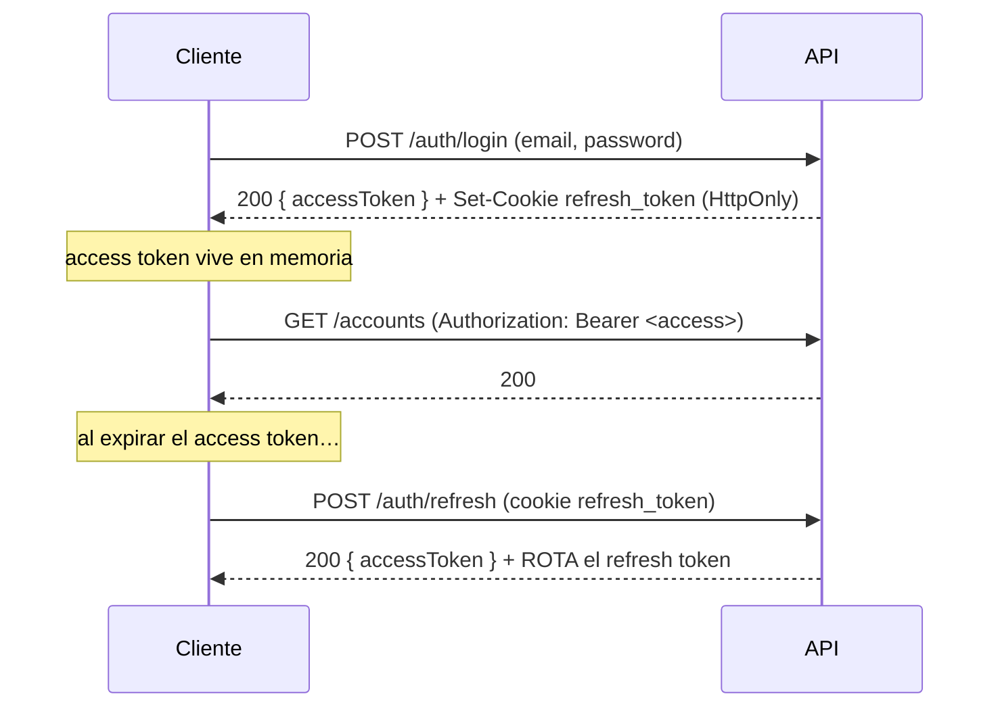

# 🛠 Finanzas App — Backend (API)

> API REST de la app de finanzas personales. **Next.js 15** (App Router) + **Prisma 6** + **PostgreSQL**.

<p align="left">
  
  
  
  
  
</p>

📦 Parte del monorepo **[Finanzas App](../../README.md)** · Puerto **3001**.

---

## 📑 Contenido

- [Stack](#-stack)
- [Estructura](#-estructura)
- [Puesta en marcha](#-puesta-en-marcha)
- [Variables de entorno](#-variables-de-entorno)
- [Scripts](#-scripts)
- [Autenticación](#-autenticación)
- [Modelo de datos](#-modelo-de-datos)
- [Endpoints](#-endpoints)
- [Reglas de negocio](#-reglas-de-negocio)
- [Documentación interactiva (Swagger)](#-documentación-interactiva-swagger)

---

## 🧰 Stack

- **Next.js 15** App Router (Route Handlers en `app/api/**/route.ts`).
- **Prisma 6** ORM sobre **PostgreSQL**.
- **Zod** para validación de entrada (errores → `422 { error, details }`).
- **Auth:** `jsonwebtoken` (JWT) + `bcryptjs` (hash) + `@simplewebauthn/server` (passkeys).
- **`web-push`** para notificaciones (VAPID).
- **`nanoid`** para tokens de split. **AES-256-GCM** para datos sensibles.

---

## 📂 Estructura

```
apps/api/
├── app/api/                  ← Route handlers (REST)
│   ├── auth/                 ← register, login, logout, refresh, me, webauthn/*
│   ├── accounts/             ← CRUD cuentas (soft-delete)
│   ├── transactions/         ← movimientos + summary
│   ├── categories/           ← categorías (sistema + usuario)
│   ├── msi/                  ← compras a meses
│   ├── recurring-income/     ← ingresos recurrentes + generate-due
│   ├── cash-flow/            ← flujo libre y obligaciones
│   ├── analisis/gastos/      ← agregado de gastos por categoría
│   ├── movimientos/          ← detalle de gastos por categoría
│   ├── split/                ← gastos compartidos (links públicos)
│   ├── notifications/        ← push + vapid-public-key
│   ├── sync/                 ← sincronización offline por lotes
│   └── docs/                 ← Swagger UI
├── lib/
│   ├── auth/                 ← jwt.ts · middleware.ts (withAuth) · password.ts
│   ├── crypto/encrypt.ts     ← AES-256-GCM
│   ├── cash-flow/calculator.ts
│   ├── msi/amortization.ts
│   ├── analisis/range.ts     ← ventanas de tiempo (semana/mes/semestre/anio)
│   ├── split/token.ts
│   ├── push/web-push.ts
│   ├── payroll-dates.ts
│   └── prisma.ts             ← cliente Prisma singleton
├── prisma/
│   ├── schema.prisma         ← 15 modelos
│   ├── migrations/           ← 5 migraciones
│   └── seed.ts               ← 30 categorías de sistema + usuario demo
└── public/openapi.yaml       ← Spec OpenAPI 3.0.3
```

---

## 🚀 Puesta en marcha

```bash
# desde la raíz del monorepo
cp .env.example apps/api/.env     # configura DB, JWT, AES, VAPID, WebAuthn

npm run db:migrate                # aplica migraciones Prisma
npm run db:seed                   # categorías de sistema + usuario demo

# arranca sólo la API
npm run dev --workspace=apps/api  # → http://localhost:3001
```

> El cliente Prisma se genera automáticamente; si hace falta, `npm run db:generate --workspace=apps/api`.

---

## 🔐 Variables de entorno

Ver la [tabla completa en el README raíz](../../README.md#-variables-de-entorno).
Resumen: `DATABASE_URL`, secretos/vigencias JWT, `ENCRYPTION_KEY`, claves `VAPID_*`,
`WEBAUTHN_*` y `NEXT_PUBLIC_APP_URL`.

---

## 📜 Scripts

| Comando | Acción |
|---------|--------|
| `npm run dev` | Next.js en modo dev (`--port 3001`). |
| `npm run build` | Build de producción. |
| `npm run start` | Sirve el build (`--port 3001`). |
| `npm run db:migrate` | `prisma migrate dev`. |
| `npm run db:push` | `prisma db push` (sin migración). |
| `npm run db:seed` | Ejecuta `prisma/seed.ts`. |
| `npm run db:studio` | Prisma Studio. |
| `npm run db:generate` | Regenera el cliente Prisma. |

_(Ejecutar con `--workspace=apps/api` desde la raíz, o directamente dentro de `apps/api`.)_

---

## 🔑 Autenticación



- **Access token (JWT):** header `Authorization: Bearer <token>`; vigencia corta (`15m`).
- **Refresh token:** cookie **`HttpOnly`** `refresh_token` (`Path=/api/auth; SameSite=Strict`).
  `POST /auth/refresh` **rota** el token en cada llamada (revoca el anterior).
- **WebAuthn / passkeys:** flujo `register-options` → `register-verify` y
  `authenticate-options` → `authenticate-verify` para login biométrico.
- **Middleware `withAuth`** (`lib/auth/middleware.ts`) protege los handlers e inyecta el `JwtPayload`.

---

## 🗄 Modelo de datos

**15 modelos** Prisma (`prisma/schema.prisma`), **5 migraciones**:

| Dominio | Modelos |
|---------|---------|
| Usuarios / sesión | `User`, `RefreshToken`, `WebAuthnCredential`, `Subscription`, `PushSubscription` |
| Finanzas | `Account`, `Category`, `Transaction`, `RecurringIncome`, `MSICredit`, `SavingsGoal` |
| Social | `SplitLink`, `SplitParticipant` |
| Sistema | `SyncConflict`, `Notification` |

El seed crea **30 categorías de sistema** (agrupadas por sección) y el [usuario demo](../../README.md#-usuario-demo).

---

## 🌐 Endpoints

> Referencia rápida. La **fuente de verdad** es [`public/openapi.yaml`](public/openapi.yaml),
> renderizada en `/api/docs`.

| Recurso | Métodos | Notas |
|---------|---------|-------|
| `/auth/register` · `/auth/login` | `POST` | Devuelven `{ accessToken, user }` + cookie. |
| `/auth/refresh` · `/auth/logout` · `/auth/me` | `POST` / `GET` | Sesión. |
| `/auth/webauthn/*` | `POST` | Passkeys (4 endpoints). |
| `/accounts` · `/accounts/{id}` | `GET POST` / `GET PATCH DELETE` | Cuentas (DELETE = soft-delete). |
| `/transactions` · `/transactions/{id}` | `GET POST` / `PATCH DELETE` | Movimientos (paginado, filtros). |
| `/transactions/summary` | `GET` | Totales del mes (Dashboard). |
| `/categories` · `/categories/{id}` | `GET POST` / `DELETE` | Agrupadas por sección. |
| `/msi` · `/msi/{id}` | `GET POST` / `GET PATCH DELETE` | Compras a meses. |
| `/recurring-income` · `/{id}` · `/generate-due` | `GET POST` / `PATCH DELETE` / `POST` | Ingresos recurrentes. |
| `/cash-flow` | `GET` | Flujo libre y obligaciones. |
| `/analisis/gastos` | `GET` | Gastos por categoría (`?rango=`). |
| `/movimientos` | `GET` | Detalle por categoría (`?categoria_id=&rango=`). |
| `/split` · `/split/my` · `/split/{token}` · `/split/{token}/pay` | varios | Gastos compartidos (links públicos). |
| `/notifications/push` · `/notifications/vapid-public-key` | `POST DELETE` / `GET` | Web Push. |
| `/sync` | `POST` | Sincronización offline (≤50 acciones). |

---

## 📐 Reglas de negocio

### Notas especiales en `Transaction.notes`

| Valor | Significado | Resumen mensual | Análisis por categoría |
|-------|-------------|:---------------:|:----------------------:|
| `'MSI'` | Compra a meses (monto total) | excluido (se suman las cuotas) | **incluido** a monto completo |
| `'TDC_PAYMENT'` | Pago de tarjeta de crédito | excluido | excluido |
| `null` / libre | Gasto/ingreso normal | incluido | incluido |

### ⚠️ Filtros Prisma _null-safe_ (bug crítico documentado)

En Prisma 6, **tanto** `NOT: { notes: 'X' }` **como** `notes: { not: 'X' }` compilan a
`NOT(notes = 'X')`, que para filas con `notes IS NULL` evalúa a `NULL` (falsy) → **descarta
esas filas**. Como la mayoría de los gastos tienen `notes = null`, esto vaciaba los reportes.

**Patrón correcto** (usado en `transactions/summary`, `analisis/gastos`, `movimientos`):

```ts
OR: [
  { notes: null },                       // conserva filas sin notes
  { notes: { notIn: ['TDC_PAYMENT'] } }, // excluye los casos especiales
]
```

### Otras reglas

- **Soft-delete de cuentas:** los agregados filtran por `account: { isActive: true }` para
  ignorar transacciones de cuentas eliminadas.
- **Doble partida:** transferencias y pagos de TDC usan `destinationAccountId` y ajustan
  ambos saldos de forma atómica (`$transaction`).
- **MSI en cash-flow:** la vista "Te queda este mes" suma las **mensualidades** vencidas de
  los `MSICredit` activos, no la compra completa.
- **Saldos de tarjeta:** `currentBalance` de una TDC = deuda al corte (`cutDebt`) + compras
  post-corte; con _guard_ de fondos insuficientes en gastos/transferencias.

---

## 📖 Documentación interactiva (Swagger)

- **UI:** `GET /api/docs` → http://localhost:3001/api/docs (Swagger UI vía CDN).
- **Spec:** [`public/openapi.yaml`](public/openapi.yaml) (OpenAPI 3.0.3), servido estáticamente
  en `/openapi.yaml`. Cubre las 31 rutas de datos; editarlo no requiere rebuild.

Autoriza con el botón **Authorize** pegando el `accessToken` (esquema `bearerAuth`).
